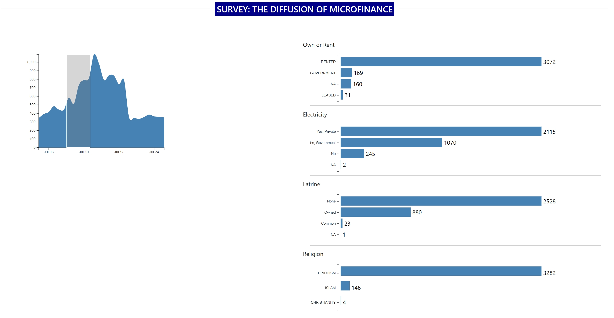

# 📈 CS171 – HW 6: The Diffusion of Micro-Finance

Interactive D3.js visualisation that explores a household–level survey on
micro-finance adoption.  
The dashboard presents

* an **area chart** showing adoption over time, and  
* four **bar charts** breaking the sample down by  
  * home ownership status  
  * access to electricity  
  * latrine availability  
  * household religion  

---

## 🔧 Tech stack

| Library / Tool | Purpose |
|----------------|---------|
| **D3.js v6**   | Drawing all charts & interactions |
| **Bootstrap 4.5** | Responsive grid & quick styling |
| **jQuery / Popper** | (transitive) Bootstrap JS deps |

---

## 📁 File structure

		├── index.html # main page
		├── css/
		│ └── style.css # custom overrides
		├── js/
		│ ├── areachart.js # reusable area-chart class
		│ ├── barchart.js # reusable bar-chart class
		│ └── main.js # loads CSV, links charts, brushing
		└── data/
		└── survey.csv # household-level dataset
		

---

## 🚀 Quick start

1. Clone or download this repository.  
2. **No build step required** – it’s plain HTML + JS.  
3. Open `index.html` in any modern browser (Chrome, Firefox, Edge).  
   > If the charts stay blank, serve the folder with a tiny web-server  
   > (`python -m http.server`) so the CSV loads without CORS issues.

---

## ✨ Dashboard interactions

| Action | Effect |
|--------|--------|
| Hover (if implemented) | Tooltip per point / bar |
| Click bar categories | Filters the area chart to the selected subgroup |
| Brushing on area chart | Updates all bar charts to the brushed years |

*(Exact interactions depend on your `main.js`; edit this table if you changed behaviour.)*

---

## 📝 Notes for graders

* Written for **CS171 – Data Visualization** (Week 06 homework).  
* All responsive sizing is handled by Bootstrap’s grid; no fixed widths.  
* Tested in Chrome 117 & Firefox 118.

---

## 📜 License

MIT for code, survey data © original authors (educational use only).

